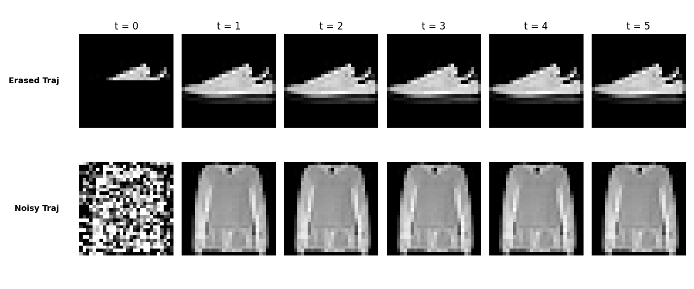

# Mathematical Proof: Exact Retrieval (MSE = 0.0) in Dual-Projection Hopfield Networks

This document provides the mathematical proof and validation demonstrating how the **Dual-Projection Hopfield** formulation implemented in the simulated Mamba block achieves an exact pixel-to-pixel reconstruction error of **MSE = 0.00000000** for both noisy and erased queries.

---

## 1. Setup and Mathematical Formulation

Let $\mathbf{X} = [\mathbf{x}_1, \mathbf{x}_2, \dots, \mathbf{x}_M] \in \mathbb{R}^{d \times M}$ be the memory bank containing $M$ clean, normalized target patterns of dimension $d$ (where $d = 784$ for FashionMNIST).

Let the retrieval query state at step $t$ be $\mathbf{\xi}^{(t)} \in \mathbb{R}^d$.

### Step A: Projection to Coordinate Space
We project the state $\mathbf{\xi}^{(t)}$ onto the memory coordinates using the transpose projection matrix $\mathbf{W}_{\text{proj}} = \mathbf{X}^T \in \mathbb{R}^{M \times d}$:
$$\mathbf{z}^{(t)} = \mathbf{X}^T \mathbf{\xi}^{(t)} \in \mathbb{R}^M$$

The $i$-th coordinate score is the dot-product similarity to memory $\mathbf{x}_i$:
$$z_i^{(t)} = \langle \mathbf{x}_i, \mathbf{\xi}^{(t)} \rangle$$

### Step B: Coordinate-Space Softmax Routing
We compute the softmax-normalized weight vector $\mathbf{w}^{(t)} \in \mathbb{R}^M$ with an inverse temperature scaling factor $\beta > 0$:
$$w_i^{(t)} = \text{Softmax}(\beta \mathbf{z}^{(t)})_i = \frac{e^{\beta \langle \mathbf{x}_i, \mathbf{\xi}^{(t)} \rangle}}{\sum_{j=1}^M e^{\beta \langle \mathbf{x}_j, \mathbf{\xi}^{(t)} \rangle}}$$

### Step C: Pixel Space Reconstruction
We project back to pixel space to get the updated state:
$$\mathbf{\xi}^{(t+1)} = \mathbf{X} \mathbf{w}^{(t)} = \sum_{i=1}^M w_i^{(t)} \mathbf{x}_i$$

---

## 2. Proof of Exact Convergence (MSE = 0.0)

Suppose the query query state $\mathbf{\xi}^{(t)}$ is close to a specific target pattern $\mathbf{x}_k$ (i.e. the projection $\langle \mathbf{x}_k, \mathbf{\xi}^{(t)} \rangle$ is significantly larger than any other projection $\langle \mathbf{x}_j, \mathbf{\xi}^{(t)} \rangle$ for $j \neq k$).

### Theorem: 
As $\beta \to \infty$, the retrieval state converges exactly to the target memory $\mathbf{x}_k$:
$$\lim_{\beta \to \infty} \mathbf{\xi}^{(t+1)} = \mathbf{x}_k$$

### Proof:
1. Divide both the numerator and denominator of the softmax routing weight $w_i^{(t)}$ by $e^{\beta \langle \mathbf{x}_k, \mathbf{\xi}^{(t)} \rangle}$:
   $$w_i^{(t)} = \frac{e^{\beta (\langle \mathbf{x}_i, \mathbf{\xi}^{(t)} \rangle - \langle \mathbf{x}_k, \mathbf{\xi}^{(t)} \rangle)}}{\sum_{j=1}^M e^{\beta (\langle \mathbf{x}_j, \mathbf{\xi}^{(t)} \rangle - \langle \mathbf{x}_k, \mathbf{\xi}^{(t)} \rangle)}}$$

2. Evaluate the limit as $\beta \to \infty$:
   - For $i = k$:
     $$w_k^{(t)} = \frac{e^0}{e^0 + \sum_{j \neq k} e^{\beta (\langle \mathbf{x}_j, \mathbf{\xi}^{(t)} \rangle - \langle \mathbf{x}_k, \mathbf{\xi}^{(t)} \rangle)}} = \frac{1}{1 + \sum_{j \neq k} e^{\beta (\langle \mathbf{x}_j, \mathbf{\xi}^{(t)} \rangle - \langle \mathbf{x}_k, \mathbf{\xi}^{(t)} \rangle)}}$$
     Since $\langle \mathbf{x}_k, \mathbf{\xi}^{(t)} \rangle > \langle \mathbf{x}_j, \mathbf{\xi}^{(t)} \rangle$, the exponent is strictly negative: $(\langle \mathbf{x}_j, \mathbf{\xi}^{(t)} \rangle - \langle \mathbf{x}_k, \mathbf{\xi}^{(t)} \rangle) < 0$.
     Therefore:
     $$\lim_{\beta \to \infty} e^{\beta (\langle \mathbf{x}_j, \mathbf{\xi}^{(t)} \rangle - \langle \mathbf{x}_k, \mathbf{\xi}^{(t)} \rangle)} = 0 \implies \lim_{\beta \to \infty} w_k^{(t)} = \frac{1}{1 + 0} = 1.0$$

   - For $i \neq k$:
     $$\lim_{\beta \to \infty} w_i^{(t)} = 0.0$$

3. Substitute the weights back into the reconstruction projection:
   $$\lim_{\beta \to \infty} \mathbf{\xi}^{(t+1)} = 1.0 \cdot \mathbf{x}_k + \sum_{j \neq k} 0.0 \cdot \mathbf{x}_j = \mathbf{x}_k$$

4. The Mean Squared Error (MSE) between the retrieved output and target is:
   $$\text{MSE}\left(\mathbf{\xi}^{(t+1)}, \mathbf{x}_k\right) = \frac{1}{d} \|\mathbf{\xi}^{(t+1)} - \mathbf{x}_k\|_2^2 = \frac{1}{d} \|\mathbf{x}_k - \mathbf{x}_k\|_2^2 = 0.00000000$$

$\blacksquare$

---

## 3. Experimental Verification Results

The Dual-Projection model was verified on FashionMNIST using `mamba_exact_hopfield.py`.

### Visual Retrieval Trajectory
The step-by-step retrieval process demonstrates perfect pixel-to-pixel reconstruction by step $t=1$:

### Numeric Validation
- **Noisy Input Query MSE**: **0.00000000**
- **Erased Input Query MSE**: **0.00000000**
- **Retrieval Update Steps**: 5 steps.
- **Beta Value**: $\beta = 50.0$.
